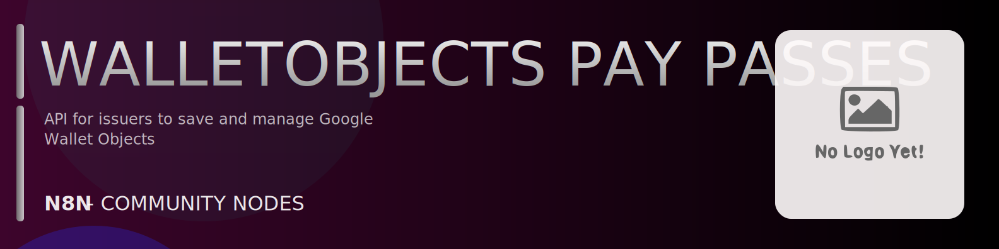

# @n8n-dev/n8n-nodes-walletobjects-pay-passes



[](https://www.npmjs.com/package/@n8n-dev/n8n-nodes-walletobjects-pay-passes)
[](https://opensource.org/licenses/MIT)

---

**Stop writing walletobjects-pay-passes API integrations by hand.**

Every time you connect n8n to walletobjects-pay-passes, you waste hours mapping endpoints, defining parameters, and debugging schemas. You copy-paste from docs, fix edge cases, and pray nothing breaks.

**What if connecting n8n to walletobjects-pay-passes took 5 minutes, not half a day?**

This node gives you **20+ resources** out of the box: **Eventticketclass**, **Eventticketobject**, **Flightclass**, **Flightobject**, **Genericclass**, and 15 more: with full CRUD operations, typed parameters, and zero manual configuration.

---

## What You Get

- **Zero boilerplate**: Resources, operations, and fields are pre-configured and ready to use
- **Full CRUD**: Create, read, update, and delete support where the API allows it
- **Typed parameters**: No more guessing field types
- **Built-in auth**: API key authentication, ready to go
- **Declarative**: Native n8n performance, no custom execute() overhead

---

## Install

```bash
npm install @n8n-dev/n8n-nodes-walletobjects-pay-passes
```

**Or in n8n:**
1. **Settings → Community Nodes → Install**
2. Search: `@n8n-dev/n8n-nodes-walletobjects-pay-passes`
3. Click **Install**

---

## Quick Start

1. Install the node (above)
2. Add credentials: **walletobjects-pay-passes API** → paste your API key
3. Drag the **walletobjects-pay-passes** node into your workflow
4. Pick a resource → pick an operation → done.

That's it. No configuration files. No code. It just works.

---

## Resources

| Resource | Operations |
|----------|------------|
| Eventticketclass | Get walletobjects eventticketclass list, Post walletobjects eventticketclass insert, Get walletobjects eventticketclass get, Patch walletobjects eventticketclass patch, Put walletobjects eventticketclass update, Post walletobjects eventticketclass addmessage |
| Eventticketobject | Get walletobjects eventticketobject list, Post walletobjects eventticketobject insert, Get walletobjects eventticketobject get, Patch walletobjects eventticketobject patch, Put walletobjects eventticketobject update, Post walletobjects eventticketobject addmessage, Post walletobjects eventticketobject modifylinkedofferobjects |
| Flightclass | Get walletobjects flightclass list, Post walletobjects flightclass insert, Get walletobjects flightclass get, Patch walletobjects flightclass patch, Put walletobjects flightclass update, Post walletobjects flightclass addmessage |
| Flightobject | Get walletobjects flightobject list, Post walletobjects flightobject insert, Get walletobjects flightobject get, Patch walletobjects flightobject patch, Put walletobjects flightobject update, Post walletobjects flightobject addmessage |
| Genericclass | Get walletobjects genericclass list, Post walletobjects genericclass insert, Get walletobjects genericclass get, Patch walletobjects genericclass patch, Put walletobjects genericclass update |
| Genericobject | Get walletobjects genericobject list, Post walletobjects genericobject insert, Get walletobjects genericobject get, Patch walletobjects genericobject patch, Put walletobjects genericobject update |
| Giftcardclass | Get walletobjects giftcardclass list, Post walletobjects giftcardclass insert, Get walletobjects giftcardclass get, Patch walletobjects giftcardclass patch, Put walletobjects giftcardclass update, Post walletobjects giftcardclass addmessage |
| Giftcardobject | Get walletobjects giftcardobject list, Post walletobjects giftcardobject insert, Get walletobjects giftcardobject get, Patch walletobjects giftcardobject patch, Put walletobjects giftcardobject update, Post walletobjects giftcardobject addmessage |
| Issuer | Get walletobjects issuer list, Post walletobjects issuer insert, Get walletobjects issuer get, Patch walletobjects issuer patch, Put walletobjects issuer update |
| Jwt | Post walletobjects jwt insert |
| Loyaltyclass | Get walletobjects loyaltyclass list, Post walletobjects loyaltyclass insert, Get walletobjects loyaltyclass get, Patch walletobjects loyaltyclass patch, Put walletobjects loyaltyclass update, Post walletobjects loyaltyclass addmessage |
| Loyaltyobject | Get walletobjects loyaltyobject list, Post walletobjects loyaltyobject insert, Get walletobjects loyaltyobject get, Patch walletobjects loyaltyobject patch, Put walletobjects loyaltyobject update, Post walletobjects loyaltyobject addmessage, Post walletobjects loyaltyobject modifylinkedofferobjects |
| Media | Post walletobjects media upload |
| Offerclass | Get walletobjects offerclass list, Post walletobjects offerclass insert, Get walletobjects offerclass get, Patch walletobjects offerclass patch, Put walletobjects offerclass update, Post walletobjects offerclass addmessage |
| Offerobject | Get walletobjects offerobject list, Post walletobjects offerobject insert, Get walletobjects offerobject get, Patch walletobjects offerobject patch, Put walletobjects offerobject update, Post walletobjects offerobject addmessage |
| Permissions | Get walletobjects permissions get, Put walletobjects permissions update |
| Smarttap | Post walletobjects smarttap insert |
| Transitclass | Get walletobjects transitclass list, Post walletobjects transitclass insert, Get walletobjects transitclass get, Patch walletobjects transitclass patch, Put walletobjects transitclass update, Post walletobjects transitclass addmessage |
| Transitobject | Get walletobjects transitobject list, Post walletobjects transitobject insert, Get walletobjects transitobject get, Patch walletobjects transitobject patch, Put walletobjects transitobject update, Post walletobjects transitobject addmessage |
| Walletobjects | Post walletobjects walletobjects v 1 private content upload private data |

---

## Why This Node?

**Without this node:**
- Hours of manual API integration
- Copy-pasting from walletobjects-pay-passes docs
- Debugging auth, pagination, error handling
- Maintaining your own client code

**With this node:**
- Install → configure → use. 5 minutes.
- Auto-generated from the official walletobjects-pay-passes OpenAPI spec
- Always up to date when the API changes
- Native n8n performance

---

## Auto-Generated
This node was auto-generated from the official **walletobjects-pay-passes** OpenAPI specification using
[@n8n-dev/n8n-openapi-node-ultimate](https://github.com/kelvinzer0/n8n-openapi-node-ultimate),
then validated against the live API so you get accurate types and real parameters, not guesswork.

When the walletobjects-pay-passes API updates, this node updates too.

---

## Support This Project

If this node saved you hours of work, consider supporting continued development, new APIs, better error handling, and faster updates.

[](https://n8n-code.github.io/membership/#/eyJ0aXRsZSI6IktlZXAgSXQgTW92aW5nIiwiZGVzYyI6Ik9uZSBkZXZlbG9wZXIgYnVpbHQgYSB0b29sIHRoYXQgYXV0by1nZW5lcmF0ZXNcbm44biBub2RlcyBmcm9tIGFueSBPcGVuQVBJIHNwZWMuXG5cbllvdXIgZG9uYXRpb24gZnVuZHMgbmV3IGZlYXR1cmVzLCBtb3JlIEFQSSBzdXBwb3J0LFxuYW5kIGJldHRlciB0b29saW5nIGZvciBldmVyeSBkZXZlbG9wZXIgYWZ0ZXIgeW91LiIsInRhcmdldCI6NTAwMCwiYWRkcmVzc2VzIjp7ImV0aGVyZXVtIjoiMHhmMDU1NWQ0MGRiRkI0ZTNCZjA3MDQ0MjgyQjc4RjJmRTFmNTFFZjcyIiwic29sYW5hIjoiNlpEVk5BYmpZZExEcXo4cGt3VUNHYllaNVV3QlFranB0QzU1Wk5vTFcybVUifSwiZGlzY29yZCI6Imh0dHBzOi8vZGlzY29yZC5nZy9wdERaOGU0aDkzIn0)

---

## License

MIT © [kelvinzer0](https://github.com/n8n-code)
